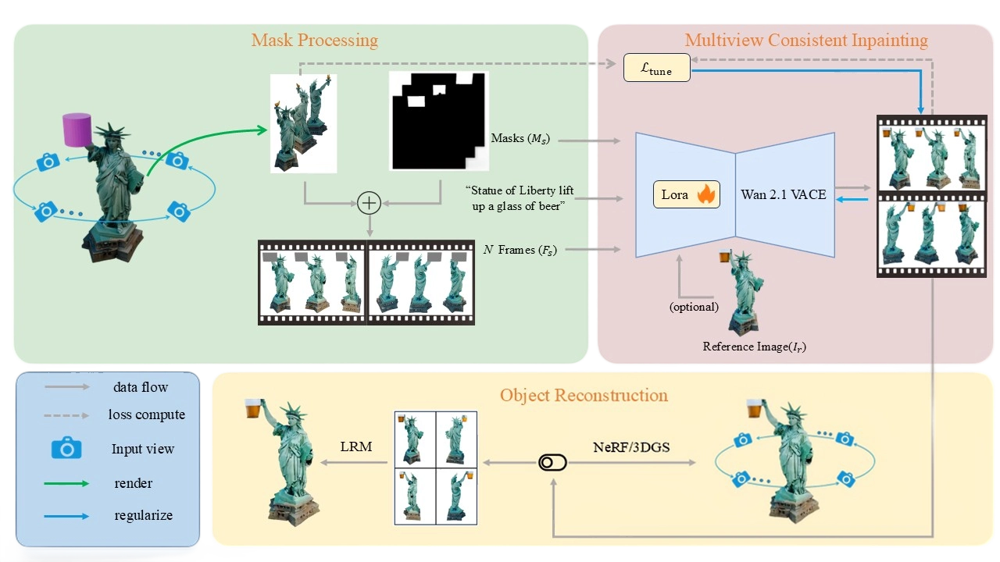
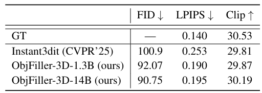
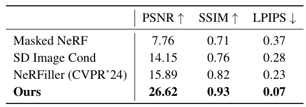

<h1>ObjFiller-3D: Consistent Multi-view 3D Inpainting via Video Diffusion Models </h1>

    Haitang Feng1&emsp;
    Jie Liu1&emsp;
    Jie Tang1&emsp;
    Gangshan Wu1&emsp;
    Beiqi Chen3&emsp;
    Jianhuang Lai4&emsp;
    Guangcong Wang2

    1Nanjing University,&emsp;
    2Great Bay University,&emsp;
    3Harbin Institute of Technology,&emsp;
    4Sun Yat-sen University&emsp;
    

### :baby_chick: [Project](https://objfiller3d.github.io/) | [YouTube](https://youtu.be/0YZoKtpvqHY) | [arXiv]() 

<tr>
    
</tr>

>:baby_chick: **TL;DR:** ObjFiller-3D is a novel method for high-quality 3D object inpainting that avoids inconsistencies from multi-view 2D approaches. By adapting advanced video editing models and introducing reference-based guidance, it achieves more accurate and coherent 3D reconstructions—outperforming prior methods in both fidelity and detail.

>:baby_chick: **Abstract:** 3D inpainting often relies on multi-view 2D image inpainting, where the inherent inconsistencies across different inpainted views can result in blurred textures, spatial discontinuities, and distracting visual artifacts. These inconsistencies pose significant challenges when striving for accurate and realistic 3D object completion, particularly in applications that demand high fidelity and structural coherence. To overcome these limitations, we propose ObjFiller-3D, a novel method designed for the completion and editing of high-quality and consistent 3D objects. Instead of employing a conventional 2D image inpainting model, our approach leverages a curated selection of state-of-the-art video editing model to fill in the masked regions of 3D objects. We analyze the representation gap between 3D and videos, and propose an adaptation of a video inpainting model for 3D scene inpainting. In addition, we introduce a reference-based 3D inpainting method to further enhance the quality of reconstruction. Experiments across diverse datasets show that compared to previous methods, ObjFiller-3D produces more faithful and fine-grained reconstructions (PSNR of 26.6 vs. NeRFiller (15.9) and LPIPS of 0.19 vs. Instant3dit (0.25)). Moreover, it demonstrates strong potential for practical deployment in real-world 3D editing applications.

<tr>
    
</tr>

>:baby_chick: **Framework Overview:**  ObjFiller-3D comprises three principal stages: mask processing, multi-view consistent inpainting, and object reconstruction. In the mask processing stage, we begin by rendering the incomplete object along a predefined camera trajectory to generate multi-view consistent 3D masks and corresponding image frames. In the multi-view consistent inpainting stage, the image frames, masks, textual prompts, and an optional reference image are fed into a fine-tuned VACE model to produce inpainted frames with coherent visual content across views. Finally, the complete object is reconstructed using NeRF, 3DGS, or LRM, enabling efficient and high-fidelity 3D synthesis.

<tr>
    
</tr>

>:baby_chick: **Quantitative result compare to Instant3dit.:**  We compare our result with the latest method Instant3dit on three aspect. FID scores are computed between the synthesized images and the ground truth (GT).

<tr>
    
</tr>

>:baby_chick: **Quantitative result compare to NeRFiller.:**  All evaluation metrics have improved by a large margin compared to baselines.

##  Citation

If you find this useful for your research, please cite the our paper.
